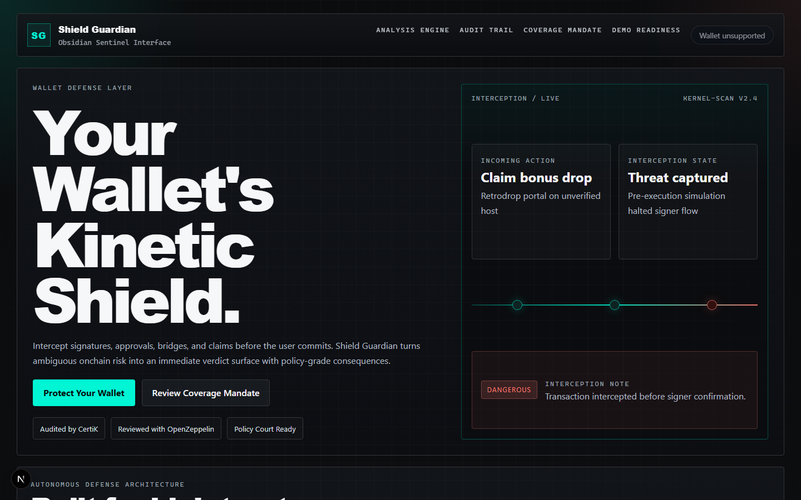
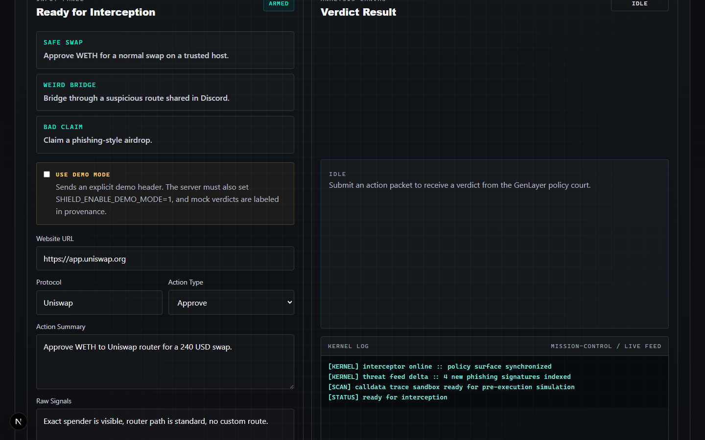
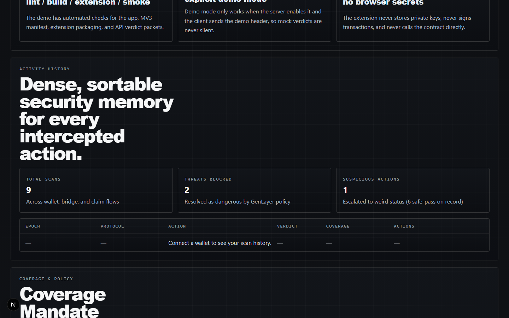

# Shield Guardian

A wallet decision layer for EVM dapps. Shield turns action packets approvals, bridges, claims, signatures into live verdicts before the user signs. Verdicts are signed in the browser against a GenLayer policy court on Studionet, so the dapp never holds a private key.

**Status:** MVP web path live. Manual smoke passed 2026-05-21. `lint`, `build`, and `verify:all` are green on `main`.



## What it does

- Browser-signed live verdicts on GenLayer Studionet — `msg.sender` is the user's wallet, not a server account.
- Verdict UI walks the user through preflight → signing → broadcast → receipt → result before they commit.
- Optional Chrome MV3 companion extension (bonus material, not required for the demo).

## Quick demo

Prerequisites: Node 20+, a Chromium browser with MetaMask, the Studionet chain configured (chain id `61999` / `0xf22f`).

Create `.env.local` in the repo root:

```env
GENLAYER_RPC_URL=https://studio.genlayer.com/api
GENLAYER_CONTRACT_ADDRESS=0x878b7E60d9b6afD46d7B2981003dd5f2a6871286
NEXT_PUBLIC_PHASE_B_CONTRACT=0x878b7E60d9b6afD46d7B2981003dd5f2a6871286
SHIELD_ENABLE_DEMO_MODE=0
```

Then:

```bash
npm install
npm run dev
```

Open `http://localhost:3000`, click **Connect Wallet**, fill the analysis form (or pick an example), leave **Use demo mode** off, click **Run Analysis**, and approve the MetaMask prompt. Activity History will pick up the new check id once consensus lands.

For a step-by-step walkthrough including the demo/mock fallback, see [`DEMO.md`](./DEMO.md).

## UI tour

Submit an action packet for interception:



Per-wallet history with challenge and loss-report actions:



## How it works

1. `ShieldPage` collects the action packet and the connected wallet address.
2. The browser calls `submitBrowserVerdictRequest` (`src/lib/genlayer/browser-sdk-adapter.ts`), which signs `submit_action_check` directly on the policy court via `genlayer-js`.
3. After the receipt is accepted, the browser reads `get_check(check_id)` from the same contract and renders the verdict with reasons, risk score, confidence, and provenance.
4. `GET /api/checks` and `GET /api/overview` are the only server-side reads; they hit the contract using `GENLAYER_CONTRACT_ADDRESS`.
5. `POST /api/verdict` is reserved for explicit demo/mock requests (`SHIELD_ENABLE_DEMO_MODE=1` plus the `x-shield-demo-mode: 1` header). Live POSTs return HTTP 410 — there is no silent server-signed fallback.

Full architecture write-up: [`docs/ARCHITECTURE.md`](./docs/ARCHITECTURE.md).

## Project structure

- `src/app` — Next.js 16 routes and API handlers
- `src/features/shield` — verdict UI, examples, dashboard data, policy actions
- `src/features/wallet` — EIP-1193 wallet context and connect button
- `src/lib/genlayer` — `genlayer-js` browser adapter, chain preflight, check mapping
- `extension` — optional Chrome MV3 companion
- `contracts/shield_policy_court.py` — GenLayer intelligent contract
- `docs` — architecture, demo guide, release checkpoint, historical specs and plans

## Verification

```bash
npm run lint
npm run build
npm run verify:all
```

`verify:all` chains lint → build → static extension check → packager → unit tests → demo smoke against `/api/verdict`. Live MetaMask flows are hand-driven; there is no automated end-to-end test for them.

## Status and deferred items

- MVP web path: complete and manually validated 2026-05-21.
- Chrome MV3 overlay manual smoke (`/extension-harness` walkthrough): deferred. Not an MVP gate.
- No automated MetaMask test for live verdict, challenge, or loss-report flows.
- Older specs and plans (2026-05-07 through 2026-05-19) describe the prior server-signed `claimedRequester` design and are kept as historical record. Current architecture is the browser-signed flow.

Release snapshot: [`docs/superpowers/specs/2026-05-21-mvp-release-checkpoint.md`](./docs/superpowers/specs/2026-05-21-mvp-release-checkpoint.md).

## Links

- [`DEMO.md`](./DEMO.md) — judging walkthrough
- [`docs/ARCHITECTURE.md`](./docs/ARCHITECTURE.md) — request flow, wallet identity, runtime setup
- [`docs/superpowers/specs/2026-05-21-mvp-release-checkpoint.md`](./docs/superpowers/specs/2026-05-21-mvp-release-checkpoint.md) — handoff snapshot
- [`extension/README.md`](./extension/README.md) — optional MV3 companion
- [`contracts/shield_policy_court.py`](./contracts/shield_policy_court.py) — on-chain policy court
